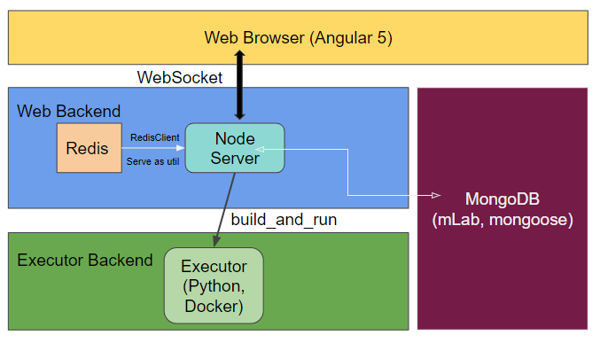

# collaborative-code-pad

### Project Description
This is a collaborative online coding platform. The idea is initiated from some code challenge sites like LeetCode, which provides a user a coding text area but no availability for multiple users' collaboration. In this application, collaboration is enabled via **socket.io** to allow multiple users to synchronize their work over the same problem and **Redis** to cache their partial works. In a high-level view, this project uses **Angular2** for the front end, **Node.js** for the web server and a **Python** written backend server to connect **Docker** container to execute the code any user submits.

### Use Cases
1. System lists all the problems
2. User views a problem's details
3. User adds a new problem
4. User toggles between navigations on top nav bar to route to pages
5. System provides an editing panel on each problem detail page
6. Multiple users simultaneously edits a problem
7. User submits a solution to a problem and System outputs the result

### Design Diagram
##### Architectural Overview

### Learning Outcomes

1. [x] Understood and mastered the core of **JavaScript**, such as callback functions and Promise.
2. [x] Learned the currently popular frontend framework **Angular2**; used **Angular CLI** to build a Single Page Application.
3. [x] Understood how **Node.js** works.
4. [x] Mastered the **RESTful API** design, which is an important data transmission method between Client and Server
5. [x] Learned the **NoSQL** theory and used **MongoDB** for data storage
6. [] Utilized key-value data store **Redis** for caching
7. [x] Did research on **WebSocket**
8. [] Learned the basic usage of **Docker** and was able to use Docker to execute the code user submitted
9. [] Learned **Python3** and used it to develop the backend server
